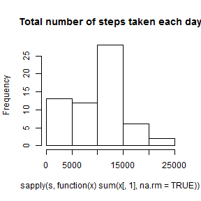
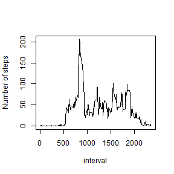
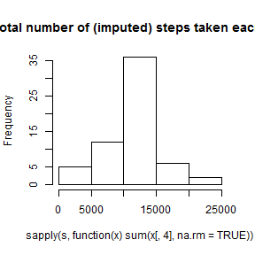
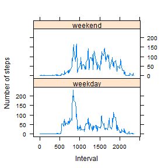

### Repr Res Peer Assessment 1

Richard Anderson


#### Loading and preprocessing the data


```r
d <- read.csv("activity.csv",header=TRUE)
```

#### What is the mean total number of steps taken per day?

1. Make a histogram of the total number of steps taken each day 


```r
s <- split(d,d$date)
```


```r
hist(sapply(s, function(x) sum(x[,1],na.rm=TRUE)),main="Total number of steps taken each day")
```

 

2. Calculate and report the mean and median
number of steps taken each day.


```r
mean(sapply(s, function(x) sum(x[,1],na.rm=TRUE)))
```

```
## [1] 9354.23
```

```r
median(sapply(s, function(x) sum(x[,1],na.rm=TRUE)))
```

```
## [1] 10395
```

#### Average daily activity pattern

1. Make a time series of the 5 min interval (x-axis) and the average number
of steps taken, avgd across all days (y-axis).


```r
s <- split(d,d$interval)
interval <- d[d$date=="2012-10-01","interval"]
activity <- sapply(s, function(x) mean(x[,1],na.rm=TRUE)) #Interval means
plot(interval,activity,type="l",ylab="Number of steps")
```

 

2. Which 5 min interval, on average across all days, contains the
maximum number of steps?


```r
names(which.max(activity))
```

```
## [1] "835"
```


#### Inputting missing values

1. Calculate and report total number of missing values in dataset.


```r
sum(!is.na(d$steps))    #number of missing values (rows w/NAs)
```

```
## [1] 15264
```

2. Devise strategy for filling in missing values in the dataset.

 I will use the mean for each 5 minute interval.


```r
fill <- rep(activity,61)
steps.fill <- numeric(length(d$steps))
#This loop fills in NAs with mean for each interval
for (i in 1:length(d$steps)) {
        if (is.na(d$steps[i])) {
                steps.fill[i] <- fill[i]
        } else {
                steps.fill[i] <- d$steps[i]
        }
}
```

3. Create a new dataset equal to the original but with NAs filled in.


```r
d.fill <- data.frame(d,steps.fill) #new filled data.frame
head(d.fill)
```

```
##   steps       date interval steps.fill
## 1    NA 2012-10-01        0  1.7169811
## 2    NA 2012-10-01        5  0.3396226
## 3    NA 2012-10-01       10  0.1320755
## 4    NA 2012-10-01       15  0.1509434
## 5    NA 2012-10-01       20  0.0754717
## 6    NA 2012-10-01       25  2.0943396
```

4. Make a histogram of the new dataset and report the new mean and median.


```r
s <- split(d.fill,d.fill$date)
hist(sapply(s, function(x) sum(x[,4],na.rm=TRUE)),main="Total number of (imputed) steps taken each day")
```

 

```r
mean(sapply(s, function(x) sum(x[,4],na.rm=TRUE)))
```

```
## [1] 10766.19
```

```r
median(sapply(s, function(x) sum(x[,4],na.rm=TRUE)))
```

```
## [1] 10766.19
```

#### Are there differences in activity patterns between weekdays and weekends?

1. Create a new factor weekday vs. weekend factor variable.


```r
#Create factor weekday vs. weekend variable
wknd <- character(length(d.fill$steps))
for (i in 1:length(d.fill$steps)) {
        if (weekdays(as.Date(d.fill$date[i]))=="Saturday" |
            weekdays(as.Date(d.fill$date[i]))=="Sunday") {
                wknd[i] <- "weekend"
        } else {
                wknd[i] <- "weekday"
        }
}
d.fill.wknd <- data.frame(d.fill,as.factor(wknd))
str(d.fill.wknd)
```

```
## 'data.frame':	17568 obs. of  5 variables:
##  $ steps          : int  NA NA NA NA NA NA NA NA NA NA ...
##  $ date           : Factor w/ 61 levels "2012-10-01","2012-10-02",..: 1 1 1 1 1 1 1 1 1 1 ...
##  $ interval       : int  0 5 10 15 20 25 30 35 40 45 ...
##  $ steps.fill     : num  1.717 0.3396 0.1321 0.1509 0.0755 ...
##  $ as.factor.wknd.: Factor w/ 2 levels "weekday","weekend": 1 1 1 1 1 1 1 1 1 1 ...
```

2. Create panel plot containing time series plot of average number
of steps for weekdays vs. weekends.


```r
#Create weekday vs. weekend activity pattern means
s <- split(d.fill.wknd,d.fill.wknd$interval)
activity.fill.wkdy <- sapply(s, function(x) 
        mean(x[x$as.factor.wknd.=="weekday",4]))
activity.fill.wknd <- sapply(s, function(x) 
        mean(x[x$as.factor.wknd.=="weekend",4]))
#Create data frame with weekday vs. weekend activity pattern mean data
weekend <- gl(2,288,labels=c("weekday","weekend"))
activity.fill.spl <- c(activity.fill.wkdy,activity.fill.wknd)
activity.wk <- data.frame(activity.fill.spl,rep(interval,2),weekend)
names(activity.wk) <- c("activity","interval","weekend")
#Create panel plot using lattice
library(lattice)
xyplot(activity ~ interval | weekend, data = activity.wk,type="l",
       layout=c(1,2),ylab="Number of steps",xlab="Interval")
```

 


