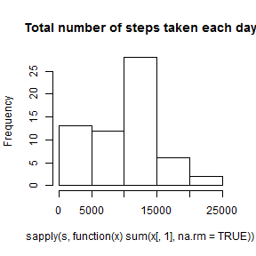
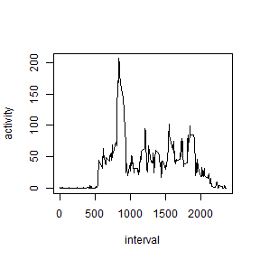
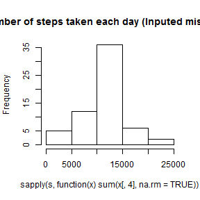
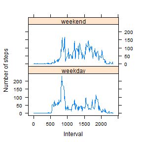

## Repr Res Peer Assessment 1

Load the data

```r
d <- read.csv("activity.csv",header=TRUE)
```

Mean total number of steps taken per day

```r
s <- split(d,d$date)
```


```r
hist(sapply(s, function(x) sum(x[,1],na.rm=TRUE)),main="Total number of steps taken each day")
```

 


```r
mean(sapply(s, function(x) sum(x[,1],na.rm=TRUE)))
```

```
## [1] 9354.23
```

```r
median(sapply(s, function(x) sum(x[,1],na.rm=TRUE)))
```

```
## [1] 10395
```

Average daily activity pattern

```r
s <- split(d,d$interval)
interval <- d[d$date=="2012-10-01","interval"]
activity <- sapply(s, function(x) mean(x[,1],na.rm=TRUE))
plot(interval,activity,type="l")
```

 

```r
which.max(activity) 
```

```
## 835 
## 104
```

Inputting missing values

```r
sum(!is.na(d$steps))    #number of missing values (rows w/NAs)
```

```
## [1] 15264
```

```r
fill <- rep(activity,61)
steps.fill <- numeric(length(d$steps))
#This loop fills in NAs with mean for each interval
for (i in 1:length(d$steps)) {
        if (is.na(d$steps[i])) {
                steps.fill[i] <- fill[i]
        } else {
                steps.fill[i] <- d$steps[i]
        }
}
d.fill <- data.frame(d,steps.fill) #new filled data.frame
s <- split(d.fill,d.fill$date)
hist(sapply(s, function(x) sum(x[,4],na.rm=TRUE)),main="Total number of steps taken each day (Inputed missing values)")
```

 

```r
mean(sapply(s, function(x) sum(x[,4],na.rm=TRUE)))
```

```
## [1] 10766.19
```

```r
median(sapply(s, function(x) sum(x[,4],na.rm=TRUE)))
```

```
## [1] 10766.19
```

Differences in activity patterns between weekdays and weekends?

```r
#Create factor weekday vs. weekend variable
wknd <- character(length(d.fill$steps))
for (i in 1:length(d.fill$steps)) {
        if (weekdays(as.Date(d.fill$date[i]))=="Saturday" |
            weekdays(as.Date(d.fill$date[i]))=="Sunday") {
                wknd[i] <- "weekend"
        } else {
                wknd[i] <- "weekday"
        }
}
d.fill.wknd <- data.frame(d.fill,as.factor(wknd))
#Create weekday vs. weekend activity pattern means
s <- split(d.fill.wknd,d.fill.wknd$interval)
activity.fill.wkdy <- sapply(s, function(x) 
        mean(x[x$as.factor.wknd.=="weekday",4]))
activity.fill.wknd <- sapply(s, function(x) 
        mean(x[x$as.factor.wknd.=="weekend",4]))
#Create data frame with weekday vs. weekend activity pattern mean data
weekend <- gl(2,288,labels=c("weekday","weekend"))
activity.fill.spl <- c(activity.fill.wkdy,activity.fill.wknd)
activity.wk <- data.frame(activity.fill.spl,rep(interval,2),weekend)
names(activity.wk) <- c("activity","interval","weekend")
#Create panel plot using lattice
library(lattice)
xyplot(activity ~ interval | weekend, data = activity.wk,type="l",
       layout=c(1,2),ylab="Number of steps",xlab="Interval")
```

 


